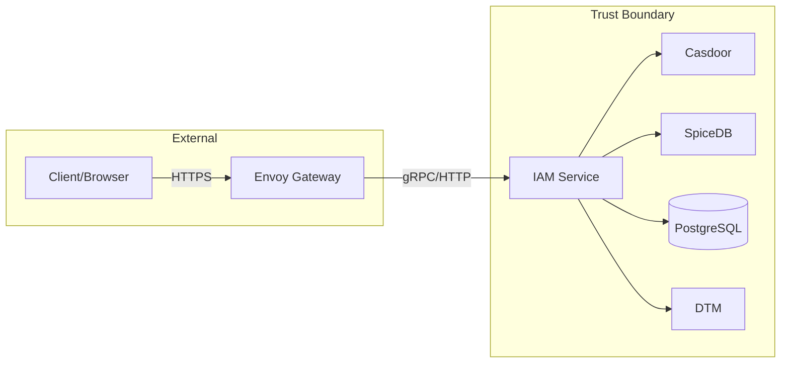

# Threat Model — Aisphere IAM

> Generated by: threat-modeler
> Date: 2026-07-13
> Cycle: C1

## System Overview

## STRIDE Analysis

### THREAT-001: Gateway trust boundary bypass

| Field | Value |
|-------|-------|
| **Component** | Envoy Gateway → IAM |
| **STRIDE** | Spoofing |
| **Likelihood** | Low |
| **Impact** | Critical |
| **Severity** | **HIGH** |
| **Attack Vector** | Attacker sends requests with spoofed `x-aisphere-*` headers directly to IAM, bypassing Gateway |
| **Mitigation** | Kernel strips external identity headers; NetworkPolicy/mTLS isolates IAM from external traffic |
| **Status** | ⏳ Architecture implemented, no E2E test evidence |

### THREAT-002: SpiceDB authorization bypass

| Field | Value |
|-------|-------|
| **Component** | IAM → SpiceDB |
| **STRIDE** | Elevation of Privilege |
| **Severity** | **CRITICAL** |
| **Attack Vector** | SpiceDB unavailable or misconfigured could cause authorization to fail open |
| **Mitigation** | Kernel authz defaults to DenyAll; DevAllowAll only in dev mode |
| **Status** | ✅ MITIGATED (DenyAll default) |

### THREAT-003: Casdoor identity provider spoofing

| Field | Value |
|-------|-------|
| **Component** | IAM → Casdoor |
| **STRIDE** | Spoofing |
| **Severity** | **CRITICAL** |
| **Attack Vector** | Attacker compromises Casdoor or MITM Casdoor API to inject fake users/orgs |
| **Mitigation** | Casdoor accessed via internal K8s service; JWT verification with public key |
| **Status** | ⏳ PARTIAL (no Casdoor HA configuration) |

### THREAT-004: SQL injection via PostgreSQL

| Field | Value |
|-------|-------|
| **Component** | IAM → PostgreSQL |
| **STRIDE** | Tampering, Information Disclosure |
| **Severity** | **CRITICAL** |
| **Attack Vector** | Malicious input in resource names, slugs, or labels could inject SQL |
| **Mitigation** | Kernel dbx uses parameterized queries (SafeUpsert, FindOne, etc.) |
| **Status** | ✅ MITIGATED (parameterized queries) |

### THREAT-005: Projection data inconsistency

| Field | Value |
|-------|-------|
| **Component** | IAM → SpiceDB (projection) |
| **STRIDE** | Tampering |
| **Severity** | **HIGH** |
| **Attack Vector** | PostgreSQL write succeeds but SpiceDB projection fails → inconsistent authorization state |
| **Mitigation** | DTM Saga with apply/compensate; retry worker; drift detection |
| **Status** | ⏳ PARTIAL (DTM disabled, no integration test) |

### THREAT-006: Audit log repudiation

| Field | Value |
|-------|-------|
| **Component** | IAM audit |
| **STRIDE** | Repudiation |
| **Severity** | **HIGH** |
| **Attack Vector** | Admin performs unauthorized action; audit log is in-memory and lost on restart |
| **Mitigation** | Audit stored in memory only (auditx.NewMemoryStore) |
| **Status** | ❌ OPEN (contract only, no durable sink) |

### THREAT-007: Grant expiry bypass

| Field | Value |
|-------|-------|
| **Component** | IAM Grant |
| **STRIDE** | Elevation of Privilege |
| **Severity** | **MEDIUM** |
| **Attack Vector** | Expired Grant continues to authorize because no cleanup worker removes SpiceDB relationship |
| **Mitigation** | Expiry represented in model; no executor/cleanup worker |
| **Status** | ❌ OPEN |

### THREAT-008: Cross-zone data leakage

| Field | Value |
|-------|-------|
| **Component** | IAM Project/Resource list APIs |
| **STRIDE** | Information Disclosure |
| **Severity** | **HIGH** |
| **Attack Vector** | User in Zone A can enumerate Projects/Resources in Zone B |
| **Mitigation** | ListProjects filters by Principal.org_id; GetProject now validates Zone |
| **Status** | ✅ MITIGATED (fixed in C1) |

---

## Summary

| Severity | Count | Open |
|:--------:|:-----:|:----:|
| CRITICAL | 3 | 0 |
| HIGH | 3 | 2 (THREAT-006, THREAT-007) |
| MEDIUM | 1 | 1 (THREAT-007) |
| LOW | 0 | 0 |

**Critical risks are mitigated.** High risks remain for audit persistence and Grant expiry enforcement.